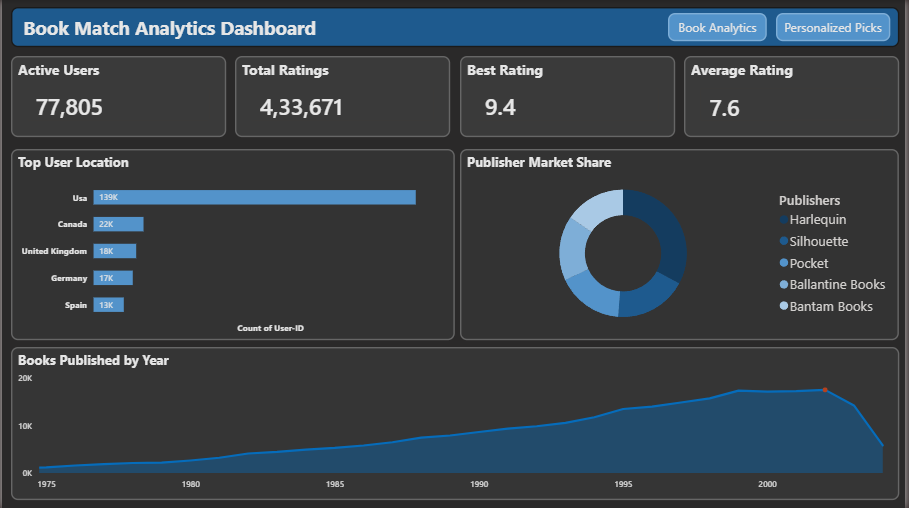
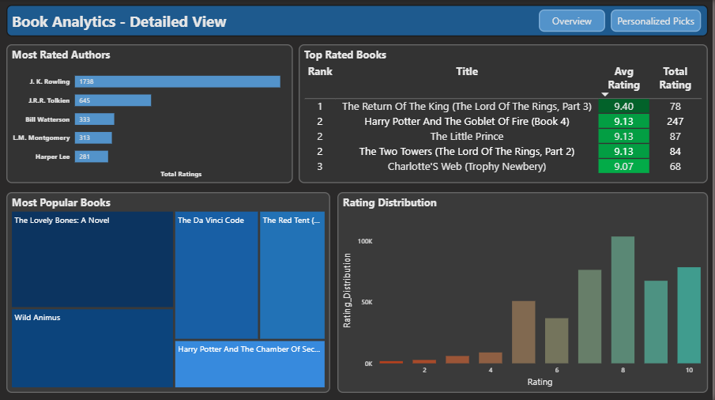
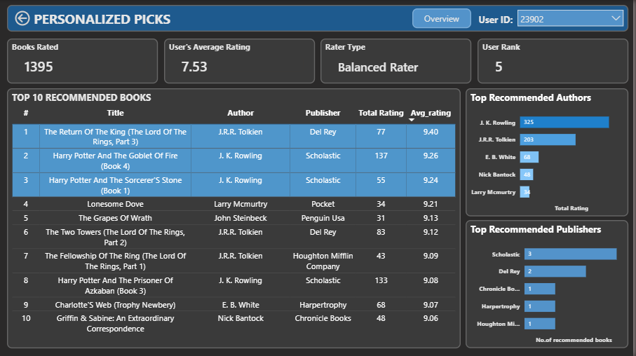

# Book-Match-Recommendation-Engine
Personalized book recommendation engine built using Excel, Python, MySQL and Power BI

A full-stack data analytics project that processes 433K+ book ratings from 77K+ users to deliver personalised book recommendations — built using Excel, Python, MySQL, and Power BI.

---

## Dashboard Preview

### Page 1 — Overview

### Page 2 — Book Analytics

### Page 3 — Personalised Picks

---

## Tools Used

- **Microsoft Excel** — Raw data cleaning and standardisation
- **Python** (pandas, SQLAlchemy, PyMySQL) — ETL pipeline and MySQL import automation
- **MySQL 8.0** — Relational database design and SQL query development
- **Power BI Desktop + DAX** — 3-page interactive dashboard and custom measures

---

## Project Scale

- Total Books — 2,71,030
- Total Users — 2,77,611
- Total Ratings Processed — 4,33,671
- Dashboard Pages — 3
- Custom DAX Measures — 8

---

## Project Workflow

Step 1 — Excel : Cleaned raw Kaggle CSV files — fixed ISBN encoding, removed duplicates, standardised text using TRIM and PROPER, resolved UTF-8 character corruption in author and publisher names

Step 2 — Python : Built an ETL pipeline using pandas and SQLAlchemy to clean and import all three datasets into MySQL — removed 700K placeholder zero ratings, fixed column names, handled BOM encoding errors, used chunked batch insertion for large files

Step 3 — MySQL : Designed a 3-table relational schema (Books, Users, Ratings) and wrote 11 SQL queries using INNER JOIN, LEFT JOIN, GROUP BY, HAVING, and subqueries to extract analytical insights and power the recommendation engine

Step 4 — Power BI : Built a 3-page interactive dashboard with 8 custom DAX measures, conditional formatting, gradient colour scales, page navigation buttons, and a dynamic User ID slicer for personalised recommendations

---

## Dashboard Pages

Page 1 — Overview
Shows 4 KPI cards (Active Users, Total Ratings, Best Rating, Average Rating), Top User Location bar chart, Publisher Market Share donut chart, and Books Published by Year area chart 

Page 2 — Book Analytics Detailed View
Shows Most Rated Authors bar chart, Top Rated Books matrix table with green conditional formatting, Most Popular Books treemap, and Rating Distribution column chart with red-to-green gradient

Page 3 — Personalised Picks
Shows a User ID dropdown slicer — selecting any user instantly displays their Books Rated, Average Rating, Rater Type (Balanced / Generous / Strict), User Rank, Top 10 Recommended Books table, Top Recommended Authors, and Top Recommended Publishers

---

## Key Features

- Dynamic User ID slicer — select any user to instantly see their personalised top 10 book recommendations
- Rater Type classification — DAX nested IF automatically classifies each user as Balanced, Generous, or Strict
- User Rank — every user ranked by total books rated using RANKX
- Community-based recommendation logic — recommends books the user has NOT yet read, ranked by community average rating
- Page navigation buttons — seamless switching between all 3 report pages

---

## Files in This Repository

- Python folder — Jupyter notebook for data cleaning and MySQL import
- SQL folder — BookMatch_Queries.sql with all analytical queries
- Screenshots folder — PNG images of all 3 dashboard pages

---

## Certification

Microsoft Certified: Power BI Data Analyst Associate — Exam PL-300

